# Building Heat Load Characterization and Clustering - Python Implementation

## Overview and Academic Context

This repository presents a comprehensive Python adaptation of the Building Heat Load Characterization and Clustering methodology, originally developed by [PhD. Roberto Garay Martínez](https://robertogaray.com/) at the Deusto Sustainable Research Group of Deustotech (University of Deusto). This work represents a significant technical achievement in migrating complex R-based energy modeling research to a modern Python High-Performance Computing (HPC) environment, with particular emphasis on SLURM job scheduling and scalable parallel processing.

The project was developed as a side-project during a research internship at Deustotech, focusing on the technological challenges of adapting sophisticated building energy analysis workflows for deployment on HPC clusters, specifically targeting the [DIPC](https://dipc.ehu.eus/) (Donostia International Physics Center) computing infrastructure.

## Background and Original Work

This Python implementation builds upon the foundational research by Roberto Garay Martínez, available at [robgaray/Building_Heat_Load_Charact_Clustering](https://github.com/robgaray/Building_Heat_Load_Charact_Clustering). The original R implementation established the theoretical framework and methodological approach for building energy performance modeling using changepoint models and clustering techniques. The present work maintains full methodological fidelity while introducing significant technological enhancements for scalability and reproducibility.

## Scientific and Methodological Foundation

### Changepoint Model Theory

The core scientific approach employs **changepoint models** (also known as energy signature models) to characterize different operational regimes in building energy consumption. These models are based on the fundamental principle that building operations can be characterized by distinct behavioral regimes, each with homogeneous thermal response characteristics.

**Mathematical Formulation**:
The changepoint model is defined as:

```
Power(T, I) = max(minimum, intercept + slope_Temp × T + slope_Irrad × I)
```

Where:
- `T` = outdoor temperature [°C]
- `I` = solar irradiation [W/m²]
- `slope_Temp` = temperature sensitivity coefficient [kW/°C]
- `slope_Irrad` = solar irradiation sensitivity coefficient [kW/(W/m²)]
- `intercept` = base load intercept [kW]
- `minimum` = minimum operational load [kW]

**Operational Regimes**:
1. **Heating regimes**: Heat load varies linearly with the difference between ambient and balance-point temperature
2. **No heating/cooling regimes**: Heat load remains at a constant minimum level
3. **Cooling regimes**: Cooling load varies linearly with temperature above the cooling balance point

### Advanced Modeling Strategies

**1. Time-of-Week (ToW) Pattern Modeling**:
This approach recognizes that building energy performance varies significantly due to occupancy and operational schedules. The methodology develops 168 individual changepoint models (24 hours × 7 days), each calibrated for specific temporal contexts. This results in approximately 840 parameters (168 × 5 parameters per model) across the complete weekly cycle.

**2. Typical Days Clustering Approach**:
To address the potential overfitting risks associated with the high-parameter ToW approach, this methodology employs unsupervised machine learning to identify representative daily consumption patterns. Daily load profiles are normalized and clustered using K-means algorithms, reducing the modeling complexity from 7 distinct day types to 3-4 representative "typical days."

**Model Attribution Framework**:
- **ToW patterns**: Direct temporal mapping based on calendar hour-of-week
- **Typical days**: Classification And Regression Tree (CART) models predict daily pattern membership using meteorological and calendar variables, enabling prospective day-type attribution without requiring actual consumption data

## Comprehensive Workflow Pipeline

The analysis methodology is implemented through a sophisticated 10-step pipeline, each step representing a critical component of the building energy characterization process. The workflow is orchestrated using Snakemake, enabling reproducible execution with automatic dependency management and parallel processing capabilities.

### Step 1: Data Loading and Preprocessing (`01_load_data.py`)

**Technical Implementation**: This step employs **Dask** for scalable data processing, enabling efficient handling of large time-series datasets that may exceed available memory.

**Process Details**:
- **Input Processing**: Reads raw building energy consumption data using Dask's distributed DataFrame operations
- **Temporal Engineering**: Creates comprehensive temporal features including hour-of-week (0-167) for ToW modeling and calendar variables
- **Memory Efficiency**: Data is processed in chunks, preventing memory overflow with lazy evaluation

**Output**: `output/01_formatted.csv` - Standardized dataset with comprehensive temporal features

### Step 2: Initial Changepoint Parameter Optimization (`02_initial_changepoint_outliers.py`)

**Technological Core**: Implements **DEAP (Distributed Evolutionary Algorithms in Python)** for genetic algorithm-based parameter optimization, combined with **Joblib** for parallel processing.

**Genetic Algorithm Process**:
- Creates populations of 50 individuals (parameter sets) with bounded constraints
- Uses sum of absolute residuals as fitness function
- Applies tournament selection, bounded crossover, and Gaussian mutation
- Distributes fitness evaluations across available CPU cores using Joblib

**HPC Integration**: Automatically detects SLURM environment and allocates cores based on `SLURM_CPUS_PER_TASK`

**Output**: `output/02_Changepoint_Parameters_summary.csv` - Optimized parameters for each hour-of-week

### Step 3: Outlier Detection and Visualization (`03_Inspection_Changepoint_Outliers.py`)

**Statistical Foundation**: Implements model-based outlier detection using changepoint residual analysis with 95% confidence intervals.

**Visualization Outputs**:
- **`03_Changepoint001.jpg`**: Temperature-power changepoint models for all 168 hours-of-week
- **`03_outliers001.jpg`**: Actual vs fitted power scatter plot with outliers in red
- **`03_outliers002.jpg`**: Temperature vs power scatter plot with outliers highlighted
- **`03_outliers003.jpg`**: Monthly outlier counts and percentages bar chart
- **`03_outliers004.jpg`**: Residuals histogram with normal distribution overlay

**Output**: `output/03_processed_data.csv` - Dataset with outlier flags and fitted values

### Step 4: Advanced Data Imputation (`04_Fill_Data.py`)

**Interpolation Strategy**: Employs sophisticated multi-scale interpolation algorithms designed for building energy time-series data.

**Technical Implementation**:
- **`repair_1h_double_side`**: Handles single-hour gaps using bidirectional weighted interpolation
- **`repair_multiple_h_double_side`**: Manages multi-hour gaps (2-5 hours) with pattern-aware interpolation
- **Quality Control**: Restricts interpolation to gaps ≤ 5 hours and validates physical bounds

**Output**: `output/04_filled_data.csv` - Complete dataset with interpolated values

### Step 5: Data Repair Validation (`05_Inspection_Fill_Data.py`)

**Validation Framework**: Visual and statistical validation of the data repair process.

**Visualizations**:
- **`05_repair001.jpg`**: Original vs corrected power scatter plot with repaired points in red
- **`05_repair002.jpg`**: Temperature vs corrected power with repaired data highlighted

### Step 6: Optimized Time-of-Week Modeling (`06_Final_Changepoint_Model.py`)

**Enhanced Optimization**: Re-runs genetic algorithm optimization with refined parameters and improved convergence.

**HPC Configuration**: Uses 8 threads per Snakemake rule with optimized memory management and real-time progress monitoring.

**Outputs**: Final processed dataset and optimized ToW model parameters

### Step 7: Unsupervised Daily Pattern Clustering (`07_Clusterization.py`)

**Machine Learning Core**: Implements **K-means clustering** using **scikit-learn** with advanced cluster optimization.

**Process**:
- **Data Preprocessing**: Row-wise min-max normalization of daily profiles
- **Cluster Optimization**: Combines Elbow method and Silhouette analysis for optimal k selection
- **Validation**: Statistical validation with reproducible results (fixed random seeds)

**Comprehensive Visualizations**:
- **`07_profiles001.jpg`**: Raw daily power profiles (up to 100 days overlaid)
- **`07_profiles002.jpg`**: Normalized daily profiles (0-1 scale)
- **`07_ElbowClust001.jpg`**: Within-cluster sum of squares vs number of clusters
- **`07_SilhouetteClust001.jpg`**: Silhouette scores for cluster validation
- **`07_Cluster001.jpg`**: Cluster assignments over time (day index vs cluster)
- **`07_ClusterN1-N4_*.jpg`**: Individual cluster profiles with mean and variability
- **`07_ClusterProfiles_003.jpg`**: Multi-panel view of all clusters with individual days

**Output**: `output/07_cluster_assignments.csv` - Daily cluster assignments with metadata

### Step 8: CART Classification Model Development (`08_CART.py`)

**Machine Learning Implementation**: Develops **Classification and Regression Tree (CART)** models using **scikit-learn** for prospective daily pattern attribution.

**Model Configuration**: Uses Gini impurity, minimum sample constraints, and maximum depth limits for robust classification.

**Model Persistence**: Uses **Joblib** for efficient model serialization with complete metadata.

**Evaluation Outputs**:
- **`09_cart_model001.jpg`**: Decision tree structure with node details and splitting criteria
- **`09_cart_model002.jpg`**: Actual vs predicted clusters over time scatter plot
- **`09_cart_model003.jpg`**: Prediction accuracy over time (correct/incorrect predictions)
- **`09_confusion_matrix.csv`** and **`09_classification_report.csv`**: Detailed performance analysis
- **`09_cart_model.pkl`**: Serialized trained model

### Step 9: Cluster-Specific Changepoint Model Development (`09_Changepoint_Clusters.py`)

**Advanced Parallel Processing**: Leverages 16-thread allocation with sophisticated parallel genetic algorithm execution.

**Dual Modeling Approach**:
- **Perfect Attribution (ClustH)**: Theoretical upper bound with perfect cluster assignment
- **CART-Predicted Attribution (ClustH_PRED)**: Realistic performance with prediction uncertainty

**Outputs**: Separate parameter files for perfect and predicted cluster attribution scenarios

### Step 10: Comprehensive Statistical Analysis (`10_Statistics_Graphics.py`)

**Statistical Framework**: Comprehensive model validation using RMSE, MAE, R², and MAPE metrics.

**Comparative Analysis**: Performance comparison across ToW models, perfect cluster attribution, and CART-predicted attribution.

**Visualization Suite**:
- **`10_Statistics_Graphics001.jpg`**: Monthly average heat load comparison (actual vs 3 models)
- **`10_Statistics_Graphics002.jpg`**: Coldest month daily distribution box plots
- **`10_Statistics_Graphics003.jpg`**: Coldest week daily distribution box plots
- **`10_Statistics_Graphics004.jpg`**: Coldest month hourly profiles (168 hours)
- **`10_Statistics_Graphics005.jpg`**: Hottest month daily distribution box plots
- **`10_Statistics_Graphics006.jpg`**: Hottest week daily distribution box plots
- **`10_Statistics_Graphics007.jpg`**: Hottest month hourly profiles (168 hours)
- **`10_Statistics_Graphics008.jpg`**: Temperate month daily distribution box plots
- **`10_Statistics_Graphics009.jpg`**: Temperate week daily distribution box plots
- **`10_Statistics_Graphics010.jpg`**: Temperate month hourly profiles (168 hours)

**Output**: `output/10_model_metrics.csv` - Comprehensive statistical summary

## Advanced Technological Solutions and Architecture

### Workflow Management and Orchestration

**Snakemake Integration**:
Snakemake serves as the backbone of the entire computational pipeline, providing sophisticated workflow management capabilities specifically designed for scientific computing workflows.

**Key Benefits**:
- **Dependency Resolution**: Automatically determines execution order based on input-output dependencies
- **Parallel Execution**: Enables concurrent processing of independent tasks with configurable thread allocation
- **Resource Management**: Dynamic resource allocation with SLURM integration for HPC environments
- **Reproducibility**: Ensures consistent execution across different computing environments
- **Scalability**: Supports scaling from single-machine to multi-node cluster execution

**HPC Integration Features**:
```python
# Snakemake SLURM configuration
SLURM_CLUSTER = False  # Toggle for HPC deployment
rule final_changepoint_model:
    threads: 8  # Configurable thread allocation
    params:
        use_slurm=SLURM_CLUSTER
```

**Workflow Flexibility**: The modular design allows for selective execution of pipeline components, enabling iterative development and debugging.

### High-Performance Parallel Computing Architecture

**DEAP (Distributed Evolutionary Algorithms in Python)**:
DEAP provides the computational core for genetic algorithm-based parameter optimization, offering sophisticated evolutionary computation capabilities.

**Technical Implementation**:
- **Population-Based Optimization**: Maintains populations of 50-100 candidate solutions
- **Genetic Operators**: Implements tournament selection, bounded crossover, and Gaussian mutation
- **Fitness Evaluation**: Parallel evaluation of fitness functions across available CPU cores
- **Convergence Control**: Advanced stopping criteria based on population diversity and fitness improvement

**Parallel Processing Benefits**:
- **Scalability**: Linear scaling with available CPU cores
- **Efficiency**: Minimizes computational overhead through optimized task distribution
- **Robustness**: Handles heterogeneous computing environments automatically

**Joblib Integration**:
Joblib provides efficient parallel processing infrastructure with intelligent load balancing and memory management.

```python
def joblib_map(func, iterable):
    if slurm_cluster:
        n_cores = int(os.environ.get("SLURM_CPUS_PER_TASK", os.cpu_count()))
    else:
        n_cores = -1  # Use all available cores
    return Parallel(n_jobs=n_cores)(delayed(func)(item) for item in iterable)
```

### Advanced Machine Learning Framework

**Scikit-learn Ecosystem**:
The project leverages scikit-learn's comprehensive machine learning library for multiple analytical components.

**K-means Clustering Implementation**:
- **Algorithm**: Lloyd's algorithm with k-means++ initialization
- **Optimization**: Multiple random initializations (n_init=10) to avoid local minima
- **Validation**: Silhouette analysis and elbow method for optimal cluster determination
- **Scalability**: Efficient implementation for large-scale daily profile datasets

**CART (Classification and Regression Trees)**:
- **Algorithm**: Gini impurity-based splitting criterion
- **Regularization**: Minimum sample constraints (min_samples_split=5, min_samples_leaf=5)
- **Pruning**: Maximum depth constraints (max_depth=5) to prevent overfitting
- **Validation**: Stratified train-test splits with comprehensive performance metrics

**Model Persistence and Deployment**:
Joblib provides efficient model serialization with metadata preservation:
```python
model_data = {
    'model': cart_model,
    'feature_names': X.columns.tolist(),
    'class_names': sorted(y.unique()),
    'training_info': {
        'train_size': X_train.shape[0],
        'test_size': X_test.shape[0],
        'features': features,
        'random_state': 42
    }
}
```

### Scalable Data Processing Infrastructure

**Dask Integration**:
Dask enables scalable data processing for large time-series datasets that exceed available memory.

**Technical Advantages**:
- **Lazy Evaluation**: Optimizes computation graphs before execution
- **Memory Management**: Processes data in chunks to prevent memory overflow
- **Parallel Operations**: Automatic parallelization of DataFrame operations
- **Integration**: Seamless integration with pandas API for familiar syntax

**Data Processing Pipeline**:
```python
df = dd.read_csv(input_file, sep=";")
df['Date'] = dd.to_datetime(df['Date'], format='%Y %m %d %H', utc=True)
df = format_input(df, col_power="Power")
```

### Advanced Visualization and Reporting System

**Matplotlib and Seaborn Integration**:
The visualization system produces publication-quality graphics with consistent styling and high-resolution output.

**Technical Specifications**:
- **Resolution**: 300 DPI output for publication quality
- **Format**: JPEG compression with quality optimization
- **Styling**: Consistent color schemes and typography across all visualizations
- **Interactivity**: Non-interactive backend (Agg) for HPC compatibility

**Comprehensive Visualization Suite**:
- **Statistical Graphics**: Distribution plots, Q-Q plots, correlation matrices
- **Time Series Analysis**: Temporal patterns, seasonal decomposition, trend analysis  
- **Model Visualization**: Decision trees, cluster profiles, performance metrics
- **Comparative Analysis**: Multi-model performance comparisons

### Environment Management and Reproducibility

**Conda Environment Management**:
The project uses Conda for comprehensive dependency management with version pinning for reproducibility.

**Environment Configuration** (`environment.yml`):
```yaml
name: changepoint_env
channels:
  - conda-forge
  - bioconda
  - defaults
dependencies:
  - python=3.10
  - snakemake
  - dask
  - matplotlib
  - scikit-learn
  - seaborn
  - deap
  - joblib
```

**Cross-Platform Compatibility**:
- **Operating Systems**: Windows, Linux, macOS support
- **Python Versions**: Tested on Python 3.10+
- **Hardware**: CPU-based processing with automatic core detection
- **Memory**: Adaptive memory management for varying system configurations

## Installation and Deployment

### Environment Setup and Installation

**Step 1: Repository Setup**
```bash
# Clone the repository
git clone <repository-url>
cd Building_Heat_Load_Charact_Clustering_Python
```

**Step 2: Conda Environment Creation**
```bash
# Create the conda environment from specification
conda env create -f environment.yml

# Activate the environment
conda activate changepoint_env

# Verify installation
python -c "import snakemake, dask, deap, sklearn; print('All dependencies installed successfully')"
```

**Step 3: Data Preparation**
Ensure your input data follows the required format:
- **Building load data** (`data/data.csv`): Semicolon-separated CSV with columns for Year, Month, Day_Month, Hour_Day, Power, Solar Irradiation and Temperature

### Configuration Options

#### Processing Multiple Files Concurrently

The workflow supports concurrent processing of multiple datasets by modifying the `SAMPLES` list in the `Snakefile`:

```python
# Single file processing (default configuration)
SAMPLES = ["data"]

# Multiple files processing - process 3 buildings simultaneously
SAMPLES = ["building1", "building2", "building3"]

# Large-scale analysis - process multiple datasets
SAMPLES = ["dataset_A", "dataset_B", "dataset_C", "dataset_D", "dataset_E"]
```

**Data File Organization**: Ensure your input files match the sample names:
- For `SAMPLES = ["building1", "building2"]`, provide:
  - `data/building1.csv`
  - `data/building2.csv`

#### SLURM Cluster Configuration

Configure the SLURM integration flag in the `Snakefile`:

```python
# For local execution (default)
SLURM_CLUSTER = False

# For HPC/SLURM cluster execution  
SLURM_CLUSTER = True
```

When `SLURM_CLUSTER = True`, the workflow automatically:
- Detects available cores from `SLURM_CPUS_PER_TASK` environment variable
- Optimizes parallel processing for cluster constraints
- Adjusts genetic algorithm population sizes for cluster efficiency

### Execution Modes and Configuration

### Local Execution (Single Machine)

**Basic Pipeline Execution**:
```bash
# Single file processing (SAMPLES = ["data"])
snakemake --cores 8

# Multiple files processing - adjust cores based on system capacity  
# For SAMPLES = ["building1", "building2", "building3"]
snakemake --cores 16

# Run with verbose output for debugging
snakemake --cores 8 --verbose

# Run specific pipeline steps
snakemake output/data_02_Changepoint_Parameters_summary.csv --cores 4
snakemake output/data_07_cluster_assignments.csv --cores 2
```

**Resource Allocation Guidelines for Multiple Files**:
- **Single file**: 8-16 cores recommended
- **Multiple files**: Scale cores proportionally (e.g., 3 files → 16-24 cores)
- **Memory**: ~2-4GB per concurrent sample
- **Processing time**: ~10-30 minutes per building dataset

**Performance Optimization**:
```bash
# Use all available CPU cores
snakemake --cores all

# Limit memory usage for resource-constrained systems
snakemake --cores 4 --resources mem_mb=8000

# Enable detailed profiling
snakemake --cores 8 --profile profile_output/
```

### HPC/SLURM Cluster Execution

**Configuration for HPC Deployment**:
1. **Edit Snakefile**: Set `SLURM_CLUSTER = True` in the Snakefile header
2. **Configure SAMPLES**: Set the list of datasets to process concurrently
3. **Configure Resource Requirements**: Adjust thread allocations based on cluster specifications

**SLURM Job Submission Examples**:

```bash
# Single file processing (SAMPLES = ["data"])
snakemake --jobs 1 \
    --cluster "sbatch -A account -t 00:20:00 -n 1 -c {threads} --mem=4G \
             --mail-type=BEGIN,END,FAIL \
             --mail-user=username@email.com" \
    --latency-wait 60

# Multiple files processing (SAMPLES = ["building1", "building2", "building3"])
# CRITICAL: --jobs parameter MUST equal len(SAMPLES) = 3
snakemake --jobs 3 \
    --cluster "sbatch -A account -t 02:00:00 -n 1 -c {threads} --mem=8G \
             --mail-type=BEGIN,END,FAIL \
             --mail-user=username@email.com" \
    --latency-wait 60

# Large-scale processing (SAMPLES = ["data1", "data2", "data3", "data4", "data5"])
# CRITICAL: --jobs parameter MUST equal len(SAMPLES) = 5  
snakemake --jobs 5 \
    --cluster "sbatch -A account -t 04:00:00 -n 1 -c {threads} --mem=12G \
             --mail-type=BEGIN,END,FAIL \
             --mail-user=username@email.com" \
    --latency-wait 60
```

**⚠️ Critical SLURM Configuration Notes**:
- **The `--jobs` parameter MUST equal `len(SAMPLES)`** for optimal parallel processing
- Each sample will be processed as an independent SLURM job
- Computational steps within each sample (genetic algorithms, clustering) utilize `{threads}` cores
- Memory and time requirements scale with dataset size and complexity
- Monitor cluster queue limits and adjust accordingly
### Input Data Specifications and Requirements

**Primary Building Load Data** (`data/data.csv`):
- **Format**: Semicolon-separated CSV file
- **Required Columns**:
  - `Year`: Calendar year (integer)
  - `Month`: Month of year (1-12)
  - `Day_Month`: Day of month (1-31)
  - `Hour_Day`: Hour of day (0-23)
  - `Power`: Energy consumption [kWh] (float)
- **Temporal Resolution**: Hourly data with consistent time stamps
- **Data Quality**: Minimal gaps (<5% missing data recommended)
- **Size**: Typically 8,760 records per year (365 days × 24 hours)

**Meteorological Data** (`data/weather_irradiation.csv`):
- **Format**: Semicolon-separated CSV file
- **Required Columns**:
  - `Temperature`: Outdoor air temperature [°C] (float)
  - `Solar_Irradiation`: Solar irradiation [W/m²] (float)
  - Temporal columns matching building load data
- **Synchronization**: Must align temporally with building load data
- **Quality**: Weather data should be from nearby meteorological stations

**Data Validation**:
```bash
# Verify data format before execution
python -c "
import pandas as pd
df = pd.read_csv('data/data.csv', sep=';')
print(f'Data shape: {df.shape}')
print(f'Columns: {df.columns.tolist()}')
print(f'Date range: {df.Year.min()}-{df.Year.max()}')
print(f'Missing values: {df.isnull().sum().sum()}')
"
```

## Comprehensive Output Structure and Results

The pipeline generates a systematic collection of outputs in the `output/` directory, organized by processing step and including both data files and high-resolution visualizations.

### Data Processing Outputs

**Step 1 - Data Loading**:
- **`01_formatted.csv`**: Standardized input dataset with comprehensive temporal features and meteorological data integration

**Step 2 - Initial Optimization**:
- **`02_Changepoint_Parameters_summary.csv`**: Genetic algorithm-optimized parameters for 168 hour-of-week models (slope_Temp, slope_Irrad, intercept, minimum)

**Step 3 - Outlier Processing**:
- **`03_processed_data.csv`**: Dataset enhanced with fitted values, residuals, and statistical outlier flags

**Step 4 - Data Repair**:
- **`04_filled_data.csv`**: Complete dataset with sophisticated interpolation for gaps and outlier replacement

**Step 6 - Final Modeling**:
- **`06_final_processed_data.csv`**: Final processed dataset with optimized fitted values
- **`06_Changepoint_Pars_summ_TOW2.csv`**: Refined Time-of-Week model parameters after final optimization

**Step 7 - Clustering Analysis**:
- **`07_cluster_assignments.csv`**: Daily cluster assignments with statistical metadata and cluster quality metrics

**Step 8 - Classification Model**:
- **`09_confusion_matrix.csv`**: Detailed confusion matrix for CART model performance evaluation
- **`09_classification_report.csv`**: Comprehensive classification metrics (precision, recall, F1-score)
- **`09_cart_model.pkl`**: Serialized CART model with metadata for deployment

**Step 9 - Cluster-Specific Models**:
- **`09_Changepoint_Pars_summ_CLUST.csv`**: Parameters for perfect cluster attribution scenario
- **`09_Changepoint_Pars_summ_CLUST_PRED.csv`**: Parameters for realistic CART-predicted attribution

**Step 10 - Statistical Analysis**:
- **`10_model_metrics.csv`**: Comprehensive performance metrics comparing all modeling approaches

### Visualization and Analysis Outputs

**Changepoint Model Visualization**:

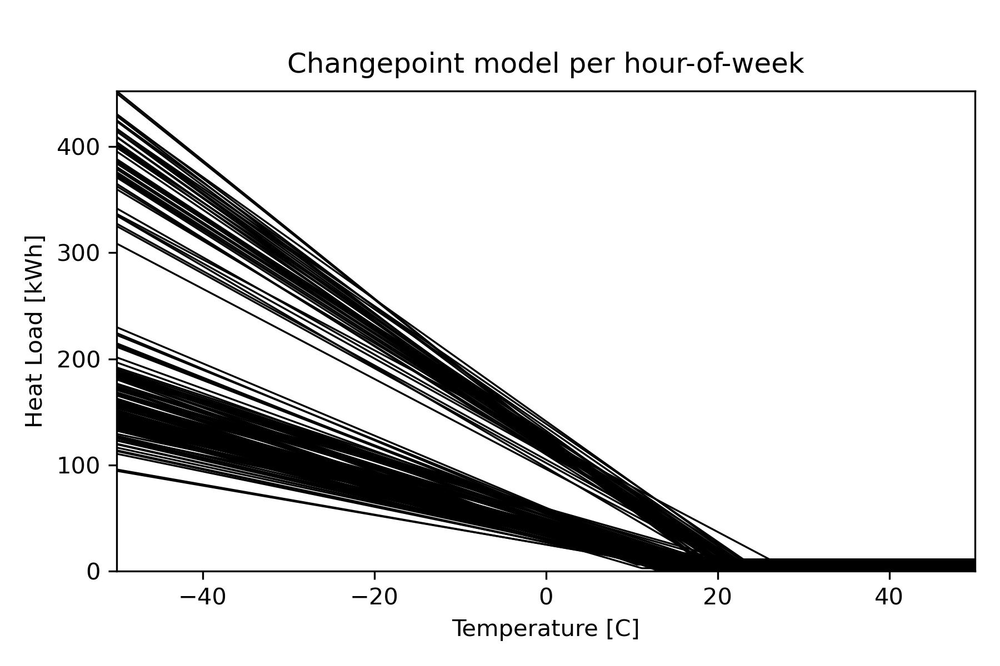

**Description**: This visualization displays all 168 hour-of-week changepoint models overlaid in temperature-load space. Each line represents a different hourly model, showing the diversity of thermal response patterns across the week. The plot reveals the characteristic three-regime behavior: a linear heating regime (negative slope), a constant minimum load regime (horizontal line), and the transition point where heating systems activate. The spread of lines demonstrates how building thermal response varies significantly by time of day and day of week, justifying the time-of-week modeling approach. Higher intercepts typically correspond to occupied hours with higher base loads, while steeper negative slopes indicate periods with more aggressive heating response to temperature drops.

**Outlier Detection Analysis**:

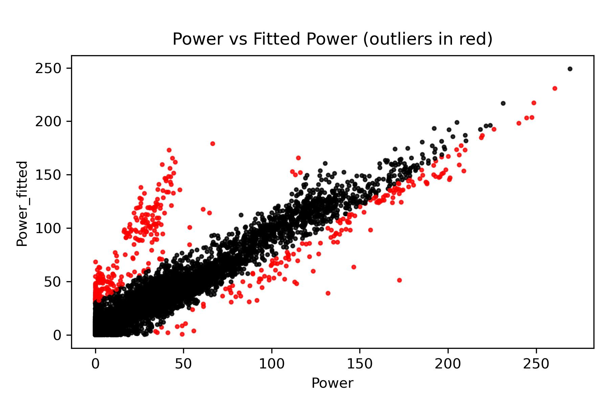

**Description**: This scatter plot shows actual power consumption vs. fitted power values from the changepoint models. Normal observations are shown in black, while outliers (identified using 95% confidence intervals) are highlighted in red. This visualization helps assess model fit quality and identify data points that deviate significantly from the expected changepoint behavior.

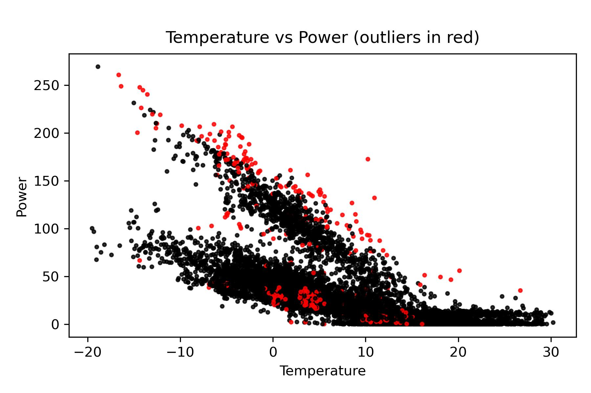

**Description**: This scatter plot displays the relationship between outdoor temperature and power consumption, with outliers highlighted in red and normal observations in black. This visualization reveals how outliers are distributed across different temperature conditions, helping identify whether outliers occur more frequently during specific weather conditions or are randomly distributed across the temperature range.

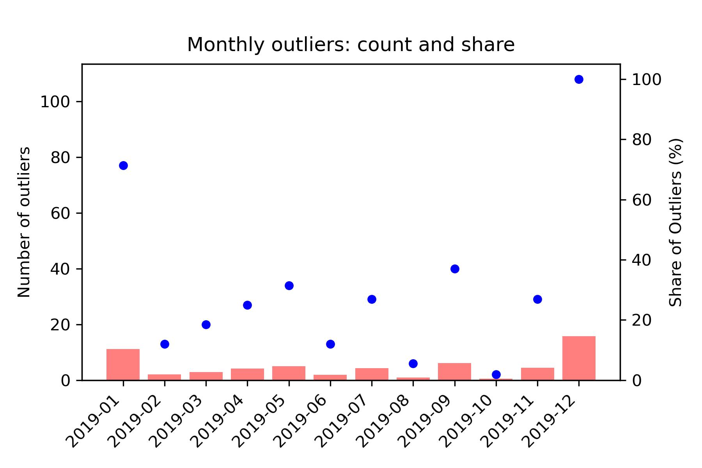

**Description**: This bar chart shows the monthly aggregation of outliers, displaying both the absolute number of outliers and their percentage of total observations for each month. This temporal analysis reveals seasonal patterns in data quality issues and helps identify months with higher rates of anomalous consumption behavior, which could be related to equipment issues, unusual weather, or operational changes.

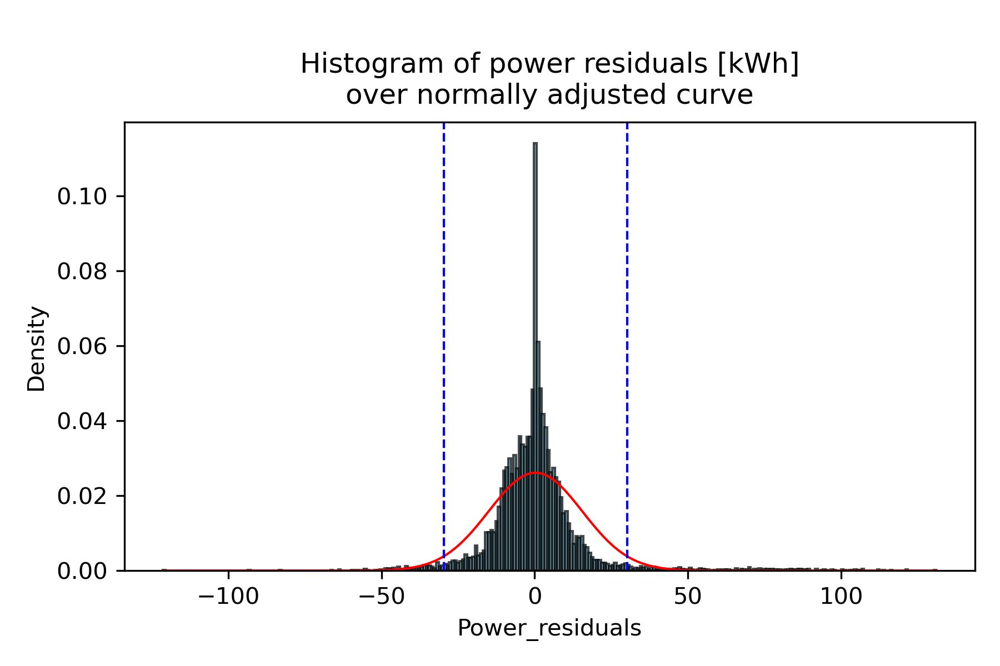

**Description**: This histogram displays the distribution of power residuals (difference between fitted and actual power values) with an overlaid normal distribution curve in red. The blue dashed lines show the 95% confidence interval boundaries used for outlier detection (±1.96 standard deviations). This visualization validates the assumption that residuals follow a normal distribution, which is fundamental to the statistical outlier detection method. Deviations from normality would suggest the need for alternative outlier detection approaches.

**Data Repair Validation**:

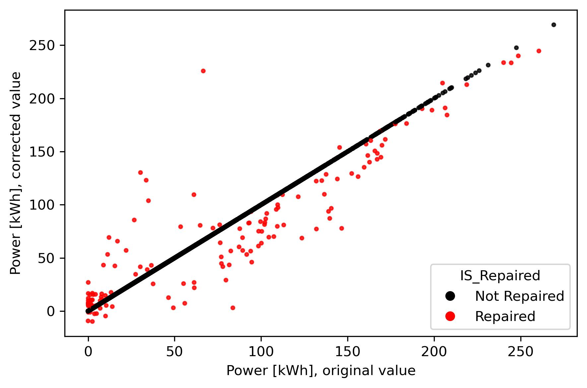

**Description**: This scatter plot compares original power values (x-axis) with corrected power values (y-axis) after the data repair process. Points in black represent data that was not repaired (original values maintained), while red points show data that was repaired through interpolation. Points along the diagonal line indicate no change, while red points off the diagonal show where interpolation has modified the original values. This visualization helps assess the extent and impact of the data repair process.

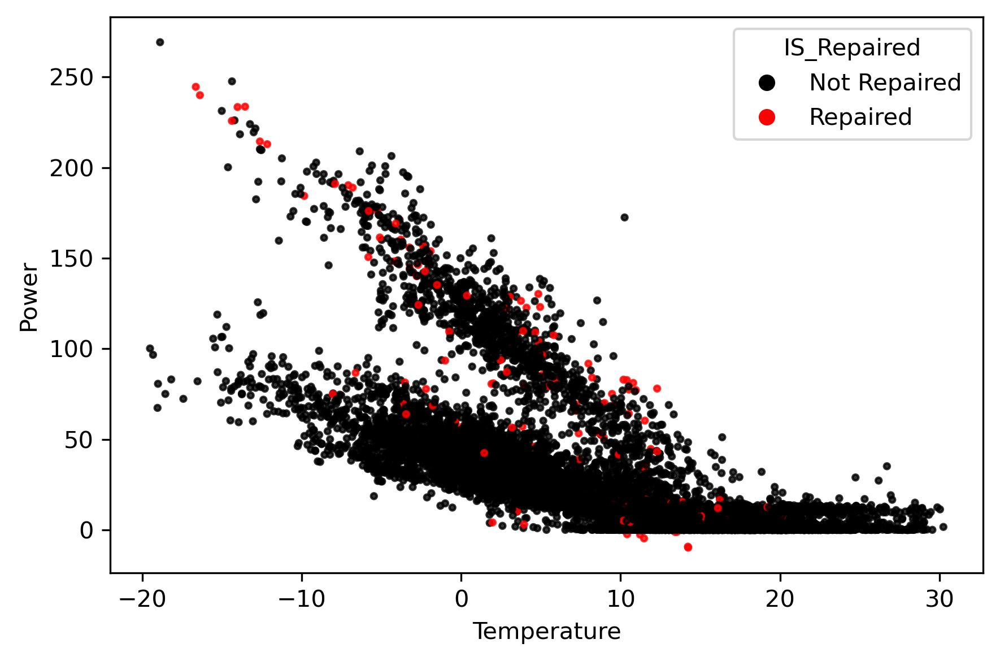

**Description**: This scatter plot shows the relationship between temperature and corrected power consumption, with repaired data points highlighted in red and original data in black. This visualization reveals how the interpolated values fit within the expected temperature-power relationship and whether the repair process maintains realistic physical relationships. Repaired points should follow the same general patterns as the original data, indicating successful interpolation that preserves the building's thermal response characteristics.

**Clustering Analysis Suite**:

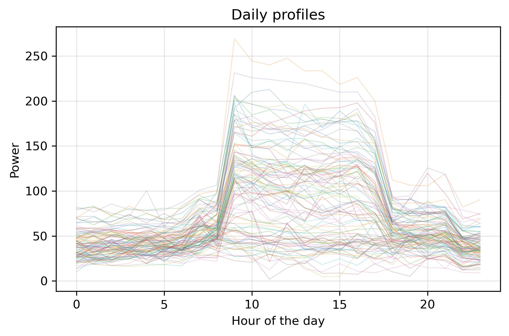

**Description**: This plot shows raw daily power consumption profiles for up to 100 days, with each semi-transparent line representing a complete 24-hour consumption pattern. The x-axis shows hours of the day (0-23) and the y-axis shows actual power consumption in kWh. The overlapping lines reveal the natural diversity in daily consumption patterns, with some profiles showing pronounced morning and evening peaks (typical of occupied building days), while others display relatively flat consumption (weekends or low-activity days).

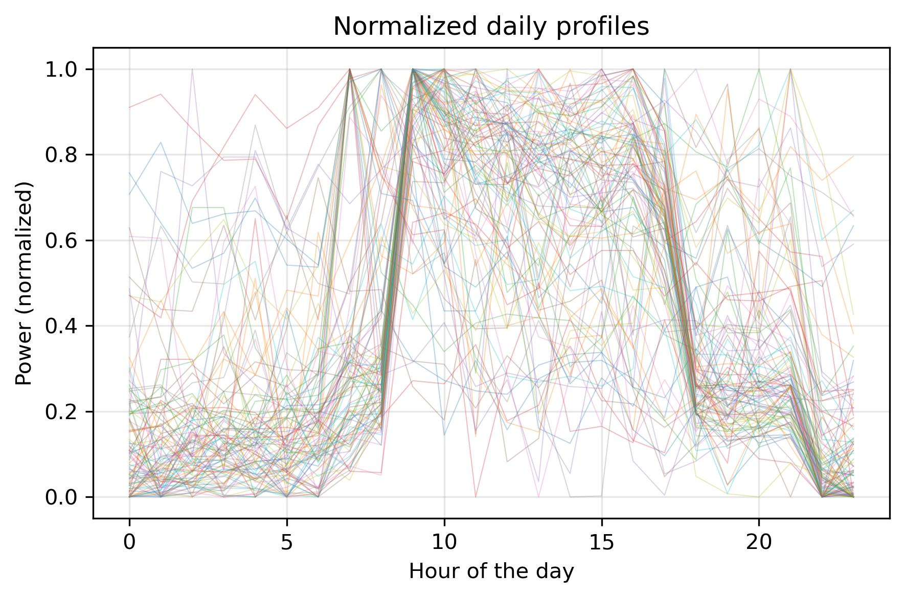

**Description**: This plot shows the same daily profiles after min-max normalization, where each day's consumption is scaled to a 0-1 range (minimum consumption = 0, maximum consumption = 1). This normalization removes the effect of absolute consumption levels and focuses on the shape of consumption patterns throughout the day. The normalized profiles make it easier to identify distinct temporal patterns regardless of the building's overall consumption magnitude.

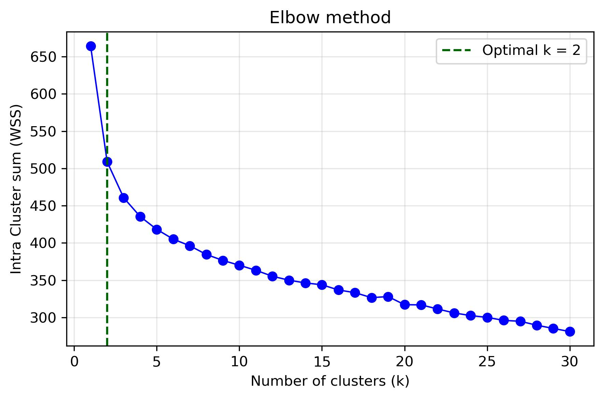

**Description**: The elbow method plot shows the within-cluster sum of squares (WSS) versus the number of clusters (k). The "elbow" point indicates the optimal number of clusters where additional clusters provide diminishing returns in terms of variance reduction. The curve shows a clear elbow around k=4, suggesting that 4 clusters provide an optimal balance between model complexity and explanatory power. Beyond this point, the curve flattens, indicating that additional clusters don't significantly improve the clustering quality.

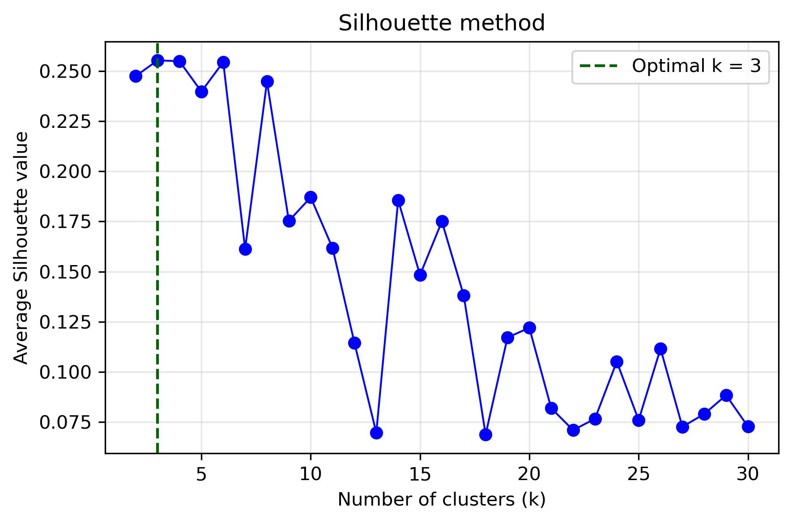

**Description**: The silhouette analysis validates cluster quality by measuring how well-separated the clusters are. Higher silhouette scores indicate better cluster separation and cohesion. The plot shows silhouette scores for different numbers of clusters, with the peak indicating the optimal clustering configuration. Values above 0.5 generally indicate good clustering, while values below 0.3 suggest poor separation. This analysis confirms the optimal number of clusters and validates the clustering quality.

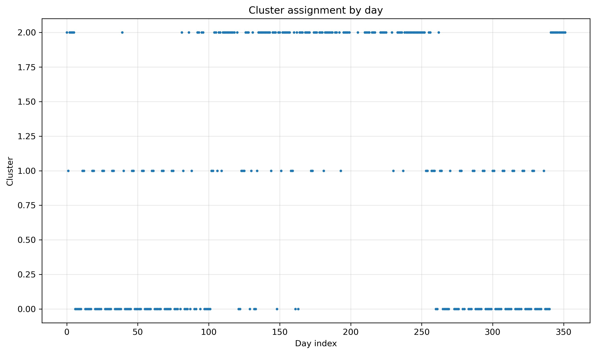

**Description**: This line plot shows cluster assignments over time, with the x-axis representing day index (sequential day number) and y-axis showing the assigned cluster number. Each point represents one day's cluster assignment. The plot reveals temporal patterns in building operation, showing how the building cycles between different operational modes (clusters) over time, with potential seasonal variations and systematic patterns related to calendar effects.

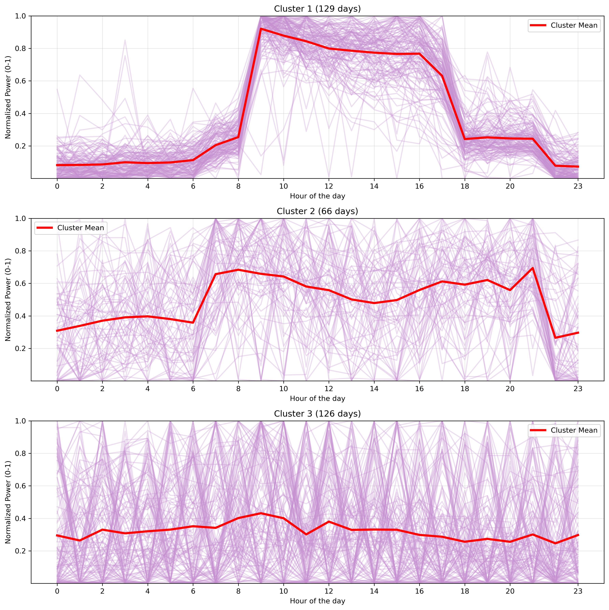

**Description**: This multi-panel plot displays all identified clusters in separate subplots, each showing individual daily profiles (light purple/pink lines) overlaid with the cluster mean profile (thick red line). Each subplot represents one cluster and shows all the days assigned to that cluster, with the y-axis normalized to 0-1 scale. The number of days in each cluster is indicated in the subplot title. This visualization allows comparison of cluster characteristics and assessment of within-cluster variability.

**CART Model Evaluation**:

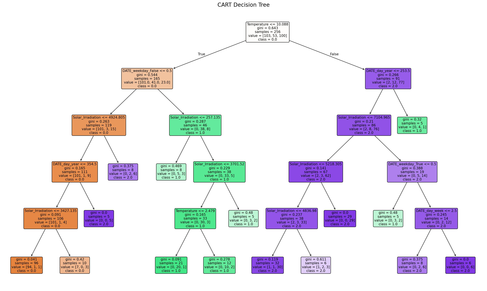

**Description**: This decision tree visualization shows the complete CART model structure with node details, splitting criteria, and class distributions. Each node displays the splitting condition (e.g., temperature thresholds, day-of-week conditions), the number of samples, and the predicted class distribution. The tree reveals the logical decision-making process: primary splits often occur on temporal variables (weekday vs. weekend), followed by meteorological conditions (temperature thresholds). Leaf nodes show the final cluster predictions with confidence measures. The tree's interpretability is a key advantage, allowing building operators to understand why specific days are classified into particular operational patterns.

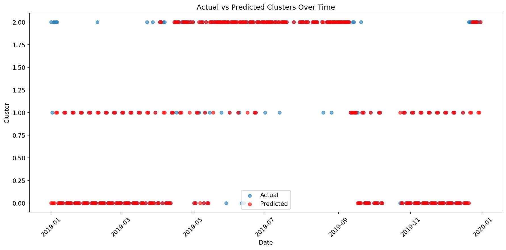

**Description**: This scatter plot shows actual cluster assignments (blue) and CART model predictions (red) over time. Each point represents a day, with the y-axis showing the cluster number. Perfect predictions would show overlapping points, while misclassifications appear as red points offset from blue points. This temporal visualization reveals how well the CART model captures seasonal patterns and whether prediction errors cluster around specific time periods or operational transitions. 

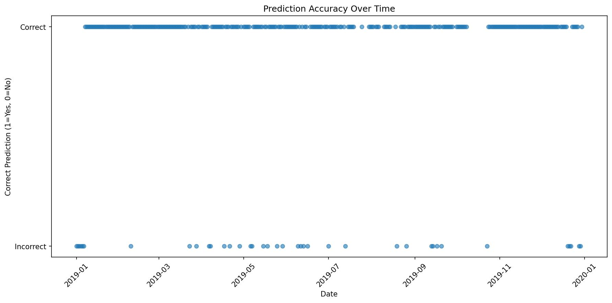

**Description**: This scatter plot displays prediction accuracy over time, where each point represents whether the CART model correctly predicted the cluster assignment for that day (1 = correct, 0 = incorrect). The temporal pattern of correct and incorrect predictions reveals the model's consistency and identifies periods when classification becomes more challenging. Clusters of incorrect predictions might indicate seasonal transitions, unusual weather periods, or operational changes that challenge the model's decision rules.

**Comprehensive Statistical Analysis**:

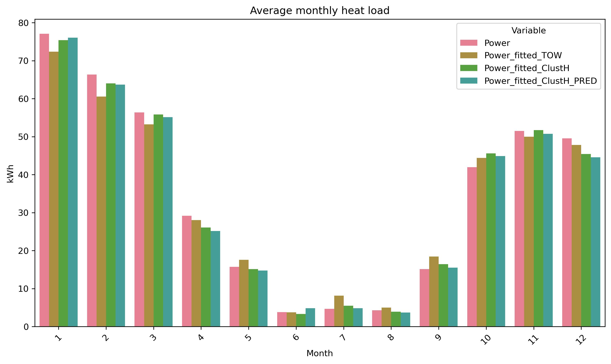

**Description**: This bar chart compares average monthly heat load between actual consumption (Power) and three different modeling approaches: Time-of-Week (TOW), perfect cluster attribution (ClustH), and CART-predicted attribution (ClustH_PRED). Each month shows four bars representing the different approaches, allowing visual comparison of how well each model captures seasonal consumption patterns. Good models should show bars that closely match the actual consumption pattern across all months.

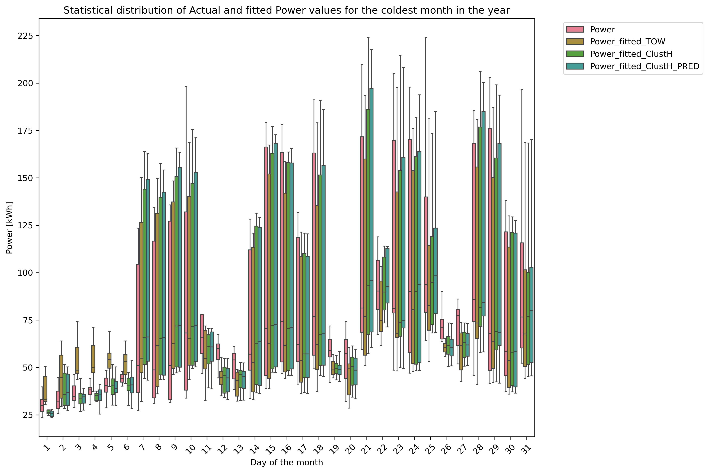

**Description**: This box plot shows the statistical distribution of actual and fitted power values for each day of the coldest month in the year. Each day shows four box plots representing actual consumption and the three modeling approaches. The boxes show quartiles, medians, and whiskers indicating the range of values. This visualization reveals how well each model captures the consumption variability during the most challenging (coldest) period when heating demand is highest.

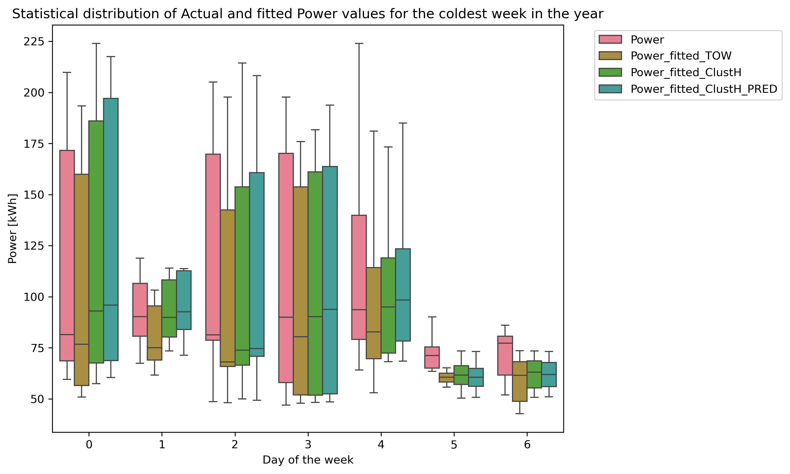

**Description**: This box plot displays the statistical distribution of actual and fitted power values for each day of the week during the coldest week in the year. Each day of the week (Monday through Sunday) shows four box plots comparing actual consumption with the three modeling approaches. This analysis reveals how well the models capture weekday vs. weekend consumption patterns during extreme cold conditions when heating systems are most active.

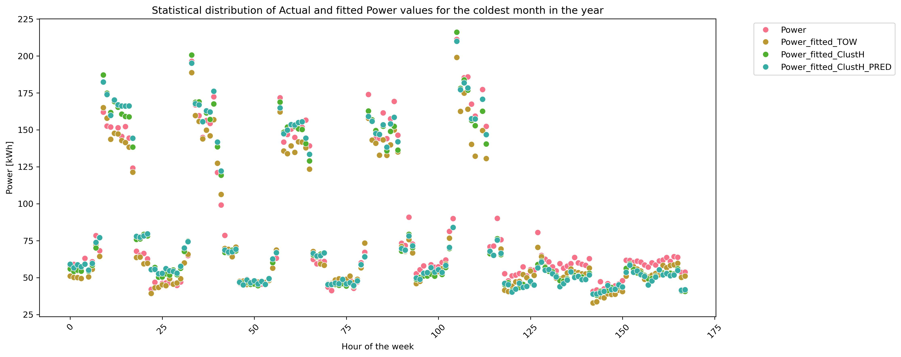

**Description**: This scatter plot shows the mean actual and fitted power values for each hour of the week (0-167) during the coldest month in the year. Each point represents one hour-of-week, with different colors for actual consumption and the three modeling approaches. The 168 hours represent the complete weekly cycle (24 hours × 7 days), revealing how well the models capture both daily patterns (peaks and valleys) and weekly patterns (weekday vs. weekend differences) during peak heating season.

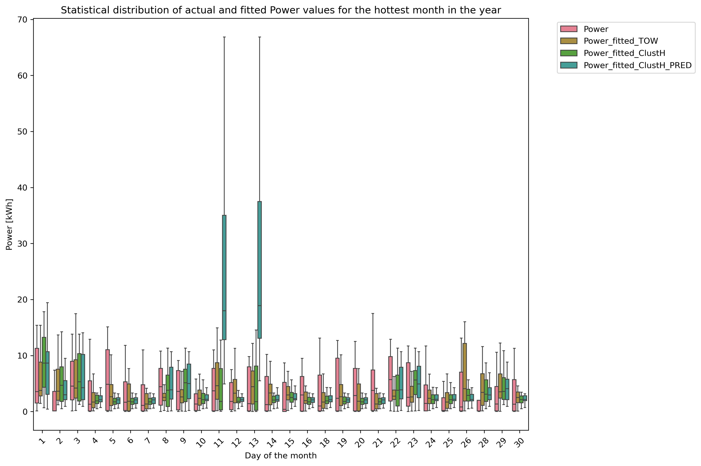

**Description**: This box plot shows the statistical distribution of actual and fitted power values for each day of the hottest month in the year. Each day displays four box plots comparing actual consumption with the three modeling approaches. This analysis reveals model performance during summer conditions when heating demand is minimal and cooling loads may dominate, representing the opposite extreme from the coldest month analysis.

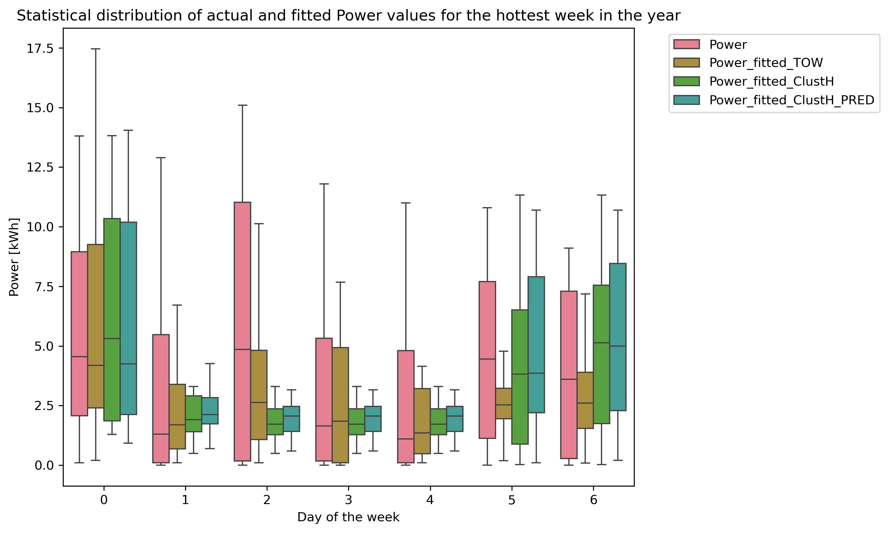

**Description**: This box plot displays the statistical distribution of actual and fitted power values for each day of the week during the hottest week in the year. Similar to the coldest week analysis, each day shows four box plots comparing actual consumption with the three modeling approaches. This reveals how well the models perform during extreme hot conditions and whether weekday/weekend patterns are maintained during summer operations.

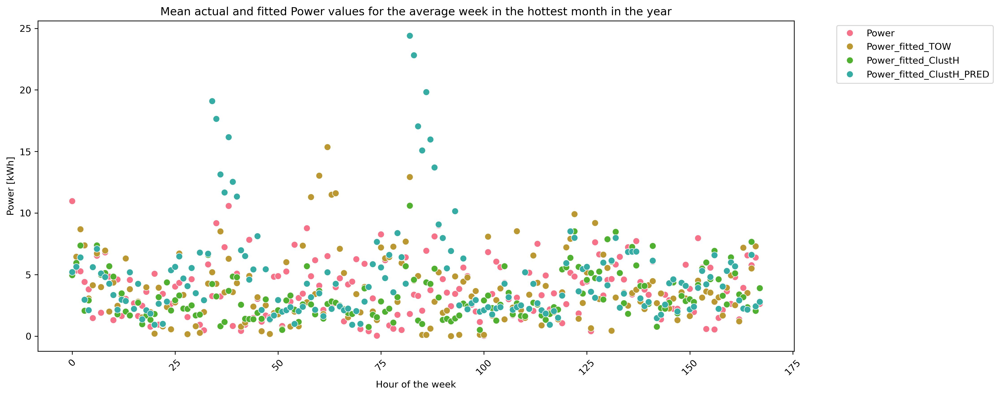

**Description**: This scatter plot shows the mean actual and fitted power values for each hour of the week during the hottest month in the year. Each point represents one hour-of-week (0-167), with different colors for actual consumption and the three modeling approaches. This analysis complements the coldest month hourly analysis, revealing how the models perform during minimal heating/potential cooling conditions and whether they maintain accuracy across the complete seasonal cycle.

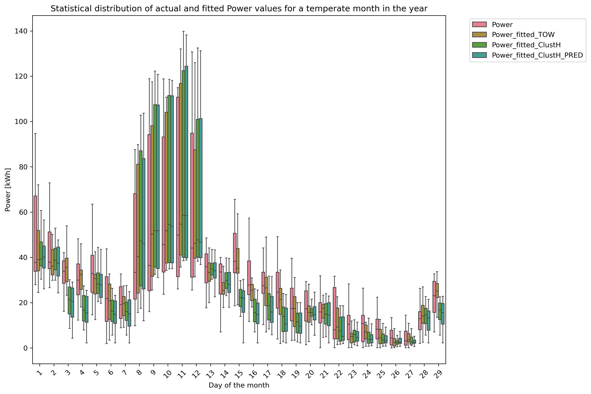

**Description**: This box plot shows the statistical distribution of actual and fitted power values for each day of a temperate (moderate temperature) month in the year. Each day displays four box plots comparing actual consumption with the three modeling approaches. This represents intermediate conditions between the extreme cold and hot months, revealing how the models perform during transition periods when heating/cooling demands are moderate.

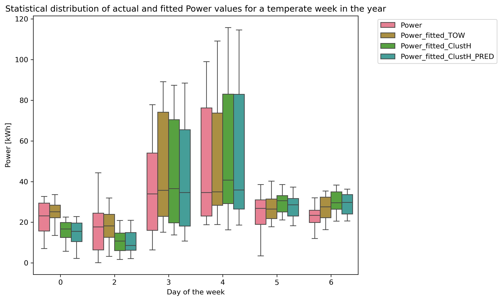

**Description**: This box plot displays the statistical distribution of actual and fitted power values for each day of the week during a temperate week in the year. Each day shows four box plots comparing actual consumption with the three modeling approaches. This analysis complements the extreme temperature week analyses, showing how the models handle moderate weather conditions and whether weekday/weekend patterns are consistent across different temperature regimes.

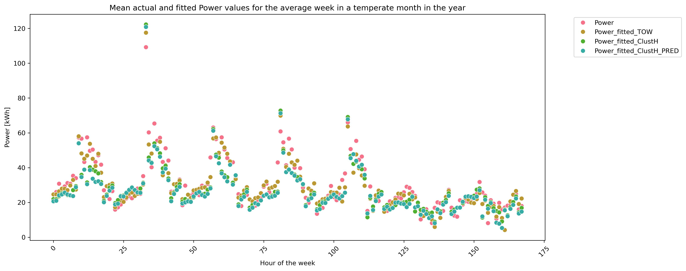

**Description**: This scatter plot shows the mean actual and fitted power values for each hour of the week during a temperate month in the year. Each point represents one hour-of-week (0-167), with different colors for actual consumption and the three modeling approaches. This final hourly analysis completes the seasonal comparison (cold, hot, temperate), providing a comprehensive view of how the models perform across the complete range of weather conditions throughout the year.

## Advanced Features and Technical Innovations

### Sophisticated Outlier Detection Framework
- **Model-Based Approach**: Uses changepoint model residuals rather than simple statistical thresholds
- **Statistical Rigor**: Implements 95% confidence intervals with normality assumption validation
- **Automated Repair**: Sophisticated multi-scale interpolation preserving temporal patterns
- **Quality Control**: Comprehensive validation of repair quality through statistical and visual methods

### Evolutionary Optimization Algorithms
- **DEAP Integration**: Advanced genetic algorithms with population-based optimization
- **Parallel Execution**: Distributed fitness evaluation across multiple CPU cores
- **Bounded Optimization**: Parameter constraints ensuring physical feasibility
- **Convergence Monitoring**: Advanced stopping criteria with diversity preservation

### Machine Learning Pipeline
- **Unsupervised Learning**: K-means clustering with optimal cluster determination
- **Supervised Classification**: CART models for prospective pattern attribution
- **Model Validation**: Comprehensive cross-validation with stratified sampling
- **Performance Metrics**: Multiple evaluation criteria (accuracy, precision, recall, F1-score)

### HPC Architecture Integration
- **SLURM Compatibility**: Native support for job scheduling and resource management
- **Dynamic Resource Allocation**: Automatic CPU and memory optimization
- **Scalable Processing**: Linear scaling from single-machine to multi-node clusters
- **Fault Tolerance**: Robust error handling and recovery mechanisms

## Model Performance and Comprehensive Validation

### Statistical Performance Metrics

The system implements multiple performance evaluation criteria to ensure robust model assessment:

**Prediction Accuracy Metrics**:
- **Root Mean Square Error (RMSE)**: √(Σ(predicted - actual)² / n) - Penalizes large errors
- **Mean Absolute Error (MAE)**: Σ|predicted - actual| / n - Robust to outliers
- **Mean Absolute Percentage Error (MAPE)**: Σ|((actual - predicted) / actual)| × 100 / n - Scale-independent assessment

**Model Fit Quality**:
- **Coefficient of Determination (R²)**: 1 - (SS_res / SS_tot) - Explained variance measure
- **Adjusted R²**: R² adjusted for number of parameters - Prevents overfitting
- **Akaike Information Criterion (AIC)**: Model selection criterion balancing fit and complexity

**Classification Performance**:
- **Confusion Matrices**: Detailed classification accuracy by cluster
- **Precision/Recall**: Class-specific performance measures
- **F1-Score**: Harmonic mean of precision and recall
- **Silhouette Coefficients**: Cluster separation quality assessment

### Comparative Model Analysis

The system evaluates three distinct modeling approaches:

1. **Time-of-Week (ToW) Models**: 168 individual hourly models providing maximum temporal specificity
2. **Perfect Cluster Attribution**: Theoretical upper bound assuming perfect daily pattern identification
3. **CART-Predicted Attribution**: Realistic performance incorporating prediction uncertainty

This comparative framework enables assessment of the trade-offs between model complexity, computational requirements, and prediction accuracy.

## Research Context and Applications

### Academic and Industrial Applications

This methodology has proven effective across diverse building energy analysis contexts:

**District Heating Systems**:
- **Load Forecasting**: Predictive modeling for district heating network optimization
- **Demand Response**: Building-level demand flexibility assessment and control
- **System Optimization**: Heat generation and distribution planning

**Building Energy Performance Assessment**:
- **Energy Auditing**: Systematic identification of operational inefficiencies
- **Benchmarking**: Comparative performance analysis across building portfolios
- **Commissioning**: Validation of building system performance post-construction

**Research and Development**:
- **Model Development**: Foundation for advanced building energy modeling techniques
- **Algorithm Testing**: Benchmark datasets for machine learning algorithm validation
- **Policy Analysis**: Evidence-based assessment of energy efficiency policies

### Technological Impact and Innovation

**Contribution to Building Energy Modeling**:
This Python implementation represents a significant advancement in the accessibility and scalability of sophisticated building energy analysis techniques. The migration from R to Python, combined with HPC integration, enables:

- **Scalability**: Analysis of large building portfolios previously computationally infeasible
- **Accessibility**: Broader adoption through Python's extensive ecosystem
- **Integration**: Seamless incorporation into existing Python-based energy analysis workflows
- **Reproducibility**: Enhanced reproducibility through containerization and environment management

**Methodological Innovations**:
- **Hybrid Modeling**: Novel combination of time-of-week and clustering approaches
- **Automated Optimization**: Genetic algorithm-based parameter calibration
- **Quality Assurance**: Comprehensive outlier detection and data repair frameworks
- **Performance Assessment**: Multi-criteria model evaluation and comparison

## Acknowledgments

This Python adaptation was developed as a side-project during my research internship at the **Deusto Sustainable Research Group** under the supervision of **PhD Roberto Garay Martínez**. The theoretical foundation and methodological approach are based on his extensive work in building energy modeling and changepoint analysis, representing years of research collaboration and methodological refinement.

## Comprehensive Literature and References

### Foundational Publications

**Core Methodological Papers**:

1. **Arregi, B., Garay, R.** (2017). *Regression analysis of the energy consumption of tertiary buildings*. Energy Procedia, 122, 9-14. [DOI: 10.1016/j.egypro.2017.07.290](https://doi.org/10.1016/j.egypro.2017.07.290)
   - **Contribution**: Established the foundation for regression-based building energy analysis

2. **Lumbreras, M., Garay-Martinez, R., Arregi, B., Martin-Escudero, K., Diarce, G., Raud, M., Hagu, I.** (2022). *Data driven model for heat load prediction in buildings connected to District Heating by using smart heat meters*. Energy, 2022. [DOI: 10.1016/j.energy.2021.122318](https://doi.org/10.1016/j.energy.2021.122318)
   - **Contribution**: Developed the Q-T algorithm and time-of-week modeling approach

3. **Lumbreras, M., Diarce, G., Martin, K., Garay-Martinez, R., Arregi, B.** (2023). *Unsupervised recognition and prediction of daily patterns in heating loads in buildings*. Journal of Building Engineering, 2023. [DOI: 10.1016/j.jobe.2022.105732](https://doi.org/10.1016/j.jobe.2022.105732)
   - **Contribution**: Introduced clustering-based daily pattern recognition and CART classification

4. **Garay-Martinez, R., Siddique, M.T., Lopez-Garde, J.M.** (2024). *Model-based Outlier Detection in District Heating Systems*. Procedia Computer Science, 246, 2024. [DOI: 10.1016/j.procs.2024.09.646](https://doi.org/10.1016/j.procs.2024.09.646)
   - **Contribution**: Advanced outlier detection methodologies and data repair techniques

### Advanced Methodological Extensions

**Recent Developments**:

5. **Borgato, N., Bordignon, S., Prataviera, E., Garay-Martinez, R., Zarrella, A.** (2025). *Enhanced methodology for disaggregating space heating and domestic hot water heat loads of buildings in district heating networks*. Applied Thermal Engineering, 2025. [DOI: 10.1016/j.applthermaleng.2024.125296](https://doi.org/10.1016/j.applthermaleng.2024.125296)
   - **Contribution**: Load disaggregation techniques for complex building systems

6. **Lopez-Villamor, I., Eguiarte, O., Arregi, B., Garay-Martinez, R., Garrido-Marijuan, A.** (2024). *Time of the week AutoRegressive eXogenous (TOW-ARX) model to predict thermal consumption in a large commercial mall*. Energy Conversion and Management: X, 2024. [DOI: 10.1016/j.ecmx.2024.100777](https://doi.org/10.1016/j.ecmx.2024.100777)
   - **Contribution**: Extension to autoregressive modeling approaches for commercial buildings

### Educational and Training Resources

**Seminar and Training Materials**:

7. **Building Heat Load Analysis Seminar**: [SMACCS_Building_Heat_Load_Analysis](https://github.com/robgaray/SMACCS_Building_Heat_Load_Analysis.git)
   - **Content**: Educational materials and practical examples

8. **Energy Consumption Analysis Workshop**: [EESIA_Analisis_Consumo_2021_Publico](https://github.com/robgaray/EESIA_Analisis_Consumo_2021_Publico.git)
   - **Content**: Public workshop materials and case studies

### Related Software Repositories

**Original and Related Implementations**:

9. **Roberto Garay** (2023). *Building Heat Load Characterisation*. Version 1. [Repository: robgaray/Building_Heat_Load_Characterisation](https://github.com/robgaray/Building_Heat_Load_Characterisation)
   - **Content**: Original R implementation with foundational algorithms

10. **Roberto Garay** (2024). *Building Heat Load Characterization and Clustering*. [Repository: robgaray/Building_Heat_Load_Charact_Clustering](https://github.com/robgaray/Building_Heat_Load_Charact_Clustering)
    - **Content**: Complete R implementation with advanced clustering capabilities

### Data Sources and Acknowledgments

**Primary Data Providers**:
- **Heat load data**: Provided by GREN TARTU (Green Energy Solutions, Tartu, Estonia)
- **Meteorological data**: University of Tartu meteorological station ([meteo.physic.ut.ee](https://meteo.physic.ut.ee/))
  - High-quality hourly weather data with comprehensive measurement parameters
  - Long-term historical records enabling robust model validation

**Data Quality and Characteristics**:
- **Temporal Resolution**: Hourly measurements with consistent time stamps
- **Spatial Representation**: Representative of Northern European climate conditions
- **Data Integrity**: Quality-controlled measurements with documented calibration procedures
---